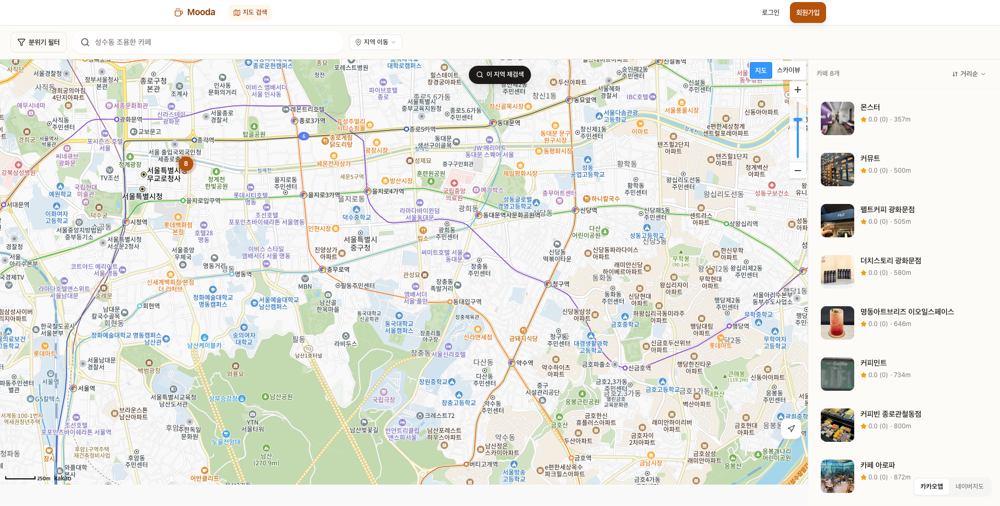
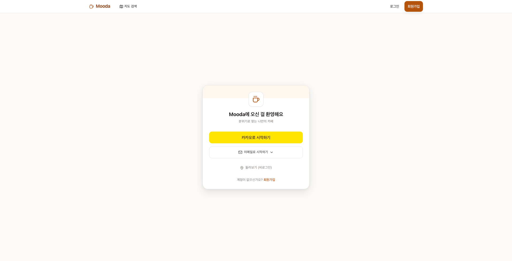
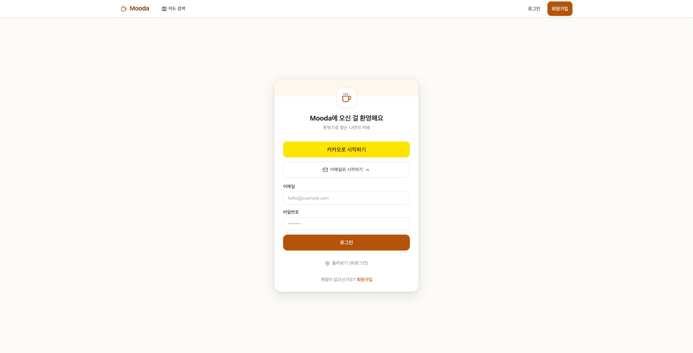
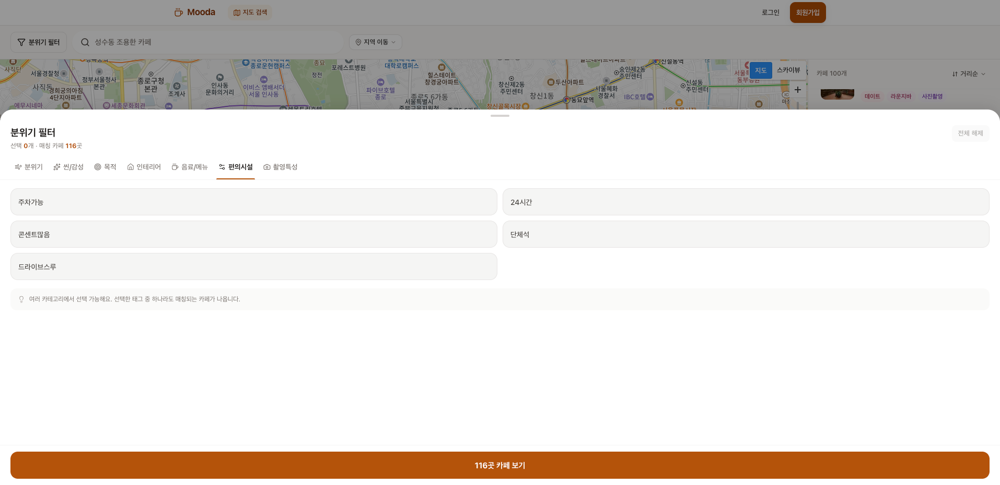
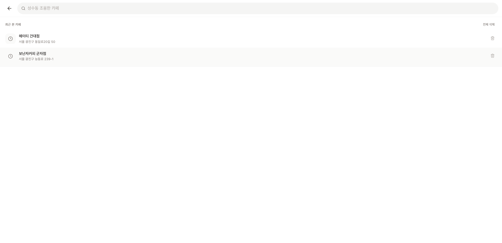
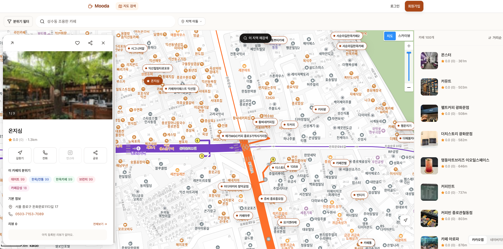
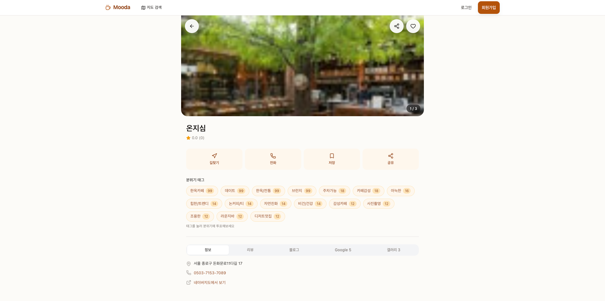
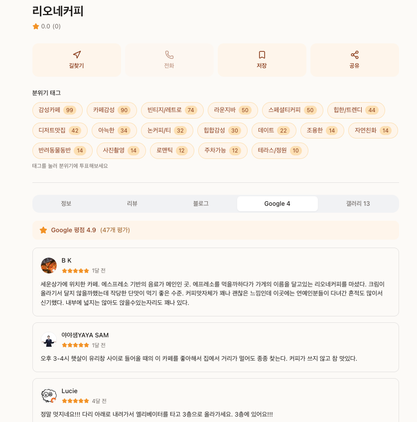

# Mooda

분위기 태그로 카페를 검색하고 카카오맵 위에서 탐색하는 웹앱.

Live: https://mooda-zio-s-projects.vercel.app



---

## 만든 이유

기존 지도 서비스에서 카페를 찾으려면 상호명이나 명확한 키워드가 필요하다. "성수동에서 조용한 카페" 같은 모호한 검색은 결과가 일정하지 않고, 막상 가보면 분위기가 다른 경우가 많다.

Mooda는 사용자 투표로 누적되는 태그 데이터를 검색의 1차 축으로 사용한다. 카페의 "이름" 이 아니라 "분위기" 로 시작점을 잡는다.

## Tech Stack

| Category | Stack |
|----------|-------|
| Framework | Next.js 16 (App Router, RSC) |
| Language | TypeScript 5 |
| Database | Supabase PostgreSQL |
| ORM | Prisma 7 (`@prisma/adapter-pg`) |
| State | Redux Toolkit + RTK Query |
| Auth | NextAuth.js v5 (Kakao OAuth + Credentials) |
| Map SDK | `react-kakao-maps-sdk` |
| Styling | styled-components (SSR) + Tailwind v4 |
| Validation | Zod + react-hook-form |
| Cache | Redis (`ioredis`) |
| Animation | Framer Motion |
| UI | Radix UI, shadcn, Lucide, Sonner |

---

## 화면

### 로그인

<table>
  <tr>
    <td></td>
    <td></td>
  </tr>
</table>

진입점 세 가지: 카카오 OAuth, 이메일·비밀번호, 비로그인 둘러보기.

- 이메일 로그인은 클릭 시 폼이 펼쳐지는 형태. 메인 화면을 가볍게 유지하기 위해 inline expand 로 처리.
- 폼 검증은 Zod 스키마(이메일 형식, 비밀번호 6자 이상)를 react-hook-form 과 공유.
- 비로그인 둘러보기는 회원가입 없이도 지도·검색·상세 조회까지 가능. 투표·저장·리뷰 작성만 로그인 필요.

`src/app/(auth)/`, `src/lib/auth.ts`

---

### 메인 — 지도와 카페 리스트


상단 헤더에 분위기 필터·키워드 검색, 우측 패널에 현재 영역의 카페 리스트.

- 지도 이동·줌마다 `bbox` 가 디바운싱(300ms) 후 RTK Query 로 재호출.
- 일정 거리 이상 이동하면 "이 지역 재검색" 칩이 노출(`ResearchAreaChip`).
- 강남·홍대·성수 등 주요 권역 바로가기, 거리/인기순 정렬.
- 우측 리스트와 지도 마커가 같은 selection state 를 공유.

`src/app/page.tsx`, `src/components/map/CafeMap.tsx`, `src/store/slices/mapSlice.ts`

---

### 분위기 필터 (바텀시트)



태그를 7개 카테고리로 분류해서 바텀시트로 띄운다. 각 카테고리는 lucide 아이콘과 고유 색상 토큰을 가진다.

| 카테고리 | 아이콘 | 예시 태그 |
|---------|------|---------|
| atmosphere | Wind | 조용한, 아늑한 |
| scene | Sparkles | 감성카페, 카페감성 |
| purpose | Target | 데이트, 작업 |
| interior | Home | 빈티지, 미니멀 |
| menu | Coffee | 스페셜티커피, 디저트맛집 |
| facility | Settings2 | 주차가능, 24시간, 콘센트 |
| photo | Camera | 사진촬영, 자연친화 |

선택한 태그는 OR 매칭. 바텀시트 하단에 결과 카페 수가 실시간으로 갱신된다.

`src/components/filter/MoodFilterSheet.tsx`, `src/constants/moods.ts`

---

### 카페 검색



카카오 로컬 API 를 백엔드 프록시로 감싼 키워드 검색.

- 최근 본 카페는 localStorage 기반, 개별/일괄 삭제.
- DB 에 없는 카페를 클릭하면 카카오 메타데이터로 자동 등록(upsert).
- 검색 결과에 Mooda 등록 여부 배지를 표시해 사용자 데이터가 쌓인 카페를 구분.

`src/app/search/SearchClient.tsx`, `src/app/api/cafes/keyword-search/route.ts`

---

### 마커 클릭 — 오버레이 카드



마커를 클릭하면 페이지 이동 없이 좌측에 오버레이 카드가 뜬다.

- 대표 사진과 영업 상태 배지(영업 중 / 마감)
- 액션 4개: 길찾기, 전화, 저장, 공유
- 사용자 투표 상위 분위기 태그 3개
- 대중교통 경로(ODsay): 현재 위치 기준 카페까지의 소요 시간

`src/components/map/CafeOverlayCard.tsx`, `src/components/map/RouteDetail.tsx`

---

### 카페 상세



서버 사이드 렌더링. SEO 와 초기 페인트를 같이 잡기 위해 `app/cafes/[id]/page.tsx` 에서 SSR 후, 인터랙션은 클라이언트 컴포넌트로 분리.

- 풀블리드 히어로 이미지 + 갤러리 라이트박스
- 액션 그리드(길찾기는 네이버 지도 앱 딥링크 → 웹 fallback)
- 분위기 태그 칩 클릭 즉시 투표 (`POST /api/cafes/[id]/moods/vote`)
- `computeOpenStatus()` 가 요일별 시간표를 평가해 현재 영업 여부 출력

`src/app/cafes/[id]/page.tsx`, `src/components/cafe/CafeDetailBody.tsx`, `src/lib/cafe/openStatus.ts`

---

### 카페 상세 — 5개 소스 탭



같은 페이지 하단에서 5개 데이터 소스를 탭으로 전환한다.

| 탭 | 소스 | 캐싱 |
|----|------|------|
| 정보 | Mooda DB (시간, 연락처, 주소) | SSR |
| 리뷰 | Mooda 자체 별점·텍스트 리뷰 | RTK Query |
| 블로그 | 네이버 블로그 검색 API | Redis 24h |
| Google | Google Places Reviews | Redis 7d |
| 갤러리 | DB 사진 + Google Places Photos | Redis 7d |

흩어져 있던 정보를 한 페이지에서 비교할 수 있도록 모았다.

`src/app/cafes/[id]/CafeDetailClient.tsx`

---

## Architecture

```
src/
├── app/
│   ├── (auth)/                   로그인, 회원가입 그룹 라우트
│   ├── api/                      API Routes
│   │   ├── cafes/                카페 CRUD, 검색, 투표, 리뷰
│   │   ├── collections/          카페 컬렉션
│   │   ├── moods/                분위기 태그 메타
│   │   ├── route/transit/        ODsay 대중교통 경로
│   │   └── users/                프로필, 즐겨찾기
│   ├── cafes/[id]/               카페 상세 (SSR + Client tabs)
│   ├── map/                      전체화면 지도 모드
│   ├── search/                   키워드 검색
│   └── profile/                  마이페이지, 컬렉션
│
├── components/
│   ├── cafe/                     CafeCard, CafeListCard, CafeDetailBody, OpenBadge
│   ├── map/                      CafeMap, BottomSheet, OverlayCard, RouteDetail, markers
│   ├── filter/                   MoodFilter, MoodFilterSheet
│   ├── search/                   키워드 검색 입력, 결과 리스트
│   ├── review/                   별점, 리뷰 카드
│   ├── collection/               카페 컬렉션
│   └── ui/                       shadcn 기반 공통 UI
│
├── store/
│   ├── api/cafesApi.ts           RTK Query 엔드포인트
│   └── slices/                   mapSlice, filterSlice, authSlice
│
├── lib/                          prisma, redis, kakao, auth, cafe util
├── constants/                    moods, paths
└── types/                        도메인 타입
```

### 카페 검색 데이터 흐름

```
사용자 지도 이동
  → mapSlice (bbox debounce 300ms)
  → useGetCafesQuery({ bbox, moods })
  → /api/cafes/nearby
  → Redis cache (TTL 5분)
     └─ miss 시 Prisma → Postgres
  → 마커 + 우측 리스트 + 카운터 동시 갱신
```

---

## Database

Prisma 7, 테이블 15개.

```
User ────┬── MoodVote ──── Mood
         │       │           │
         │    CafeMood ──────┘
         │
         ├── Review ──┬── Cafe ──── CafePhoto
         │            │       │
         │            │       ├── CafeHour
         │            │       ├── NaverBlogCache
         │            │       └── GooglePlaceCache
         │
         ├── UserFavorite
         │
         └── Collection ──── CollectionItem
```

`prisma/schema.prisma`

---

## Caching

외부 API 호출과 DB 부하를 줄이기 위한 TTL 정책.

| 데이터 | TTL | 무효화 |
|--------|-----|--------|
| 카페 검색 (`nearby`) | 5분 | — |
| 카페 상세 | 30분 | 투표·리뷰 작성 시 |
| 네이버 블로그 후기 | 24시간 | — |
| Google Places 리뷰·사진 | 7일 | — |
| 분위기 태그 메타 | 1시간 | — |

Redis 가 미설정인 환경(예: Vercel Hobby)에서는 no-op 으로 fallback. 기능은 그대로 동작하고 캐시만 비활성.

`src/lib/redis.ts`

---

## Validation

Zod 스키마로 외부 입력을 검증. 같은 스키마를 클라이언트(react-hook-form `zodResolver`)와 서버 라우트에서 공유한다.

- 인증 폼: 이메일 형식, 비밀번호 6자 이상
- 카페 검색: 좌표(lat/lng), 반경, 정렬 키 화이트리스트
- 리뷰 작성: 별점 1~5, 본문 길이
- 컬렉션 생성: 이름 필수, 중복 방지

---

## Development

```bash
yarn install

# 개발 서버
yarn dev              # webpack
yarn dev:turbo        # turbopack

# DB
yarn db:studio        # Prisma Studio
yarn db:migrate       # dev 마이그레이션
yarn db:migrate:prod  # production 마이그레이션

# 데이터
yarn seed             # 카페 시드
yarn sync:blogs       # 네이버 블로그 캐시 갱신

# 빌드
yarn build            # prisma generate → migrate deploy → next build
yarn start
```

### 환경 변수

```env
DATABASE_URL=
NEXTAUTH_SECRET=
KAKAO_CLIENT_ID=
KAKAO_CLIENT_SECRET=
NAVER_CLIENT_ID=
NAVER_CLIENT_SECRET=
GOOGLE_PLACES_API_KEY=
ODSAY_API_KEY=
REDIS_URL=             # 선택. 없으면 캐시 비활성
```
